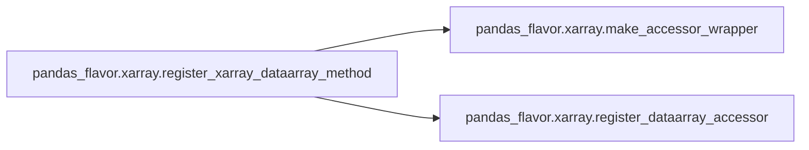
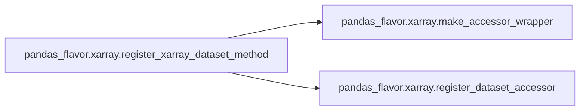

# Pandas Flavor Xarray

[_Documentation generated by Documatic_](https://www.documatic.com)

<!---Documatic-section-Codebase Structure-start--->
## Codebase Structure

<!---Documatic-block-system_architecture-start--->
```mermaid
None
```
<!---Documatic-block-system_architecture-end--->

# #
<!---Documatic-section-Codebase Structure-end--->

<!---Documatic-section-pandas_flavor.xarray.make_accessor_wrapper-start--->
## pandas_flavor.xarray.make_accessor_wrapper

<!---Documatic-section-make_accessor_wrapper-start--->
<!---Documatic-block-pandas_flavor.xarray.make_accessor_wrapper-start--->
<details>
	<summary><code>pandas_flavor.xarray.make_accessor_wrapper</code> code snippet</summary>

```python
def make_accessor_wrapper(method):

    class XRAccessor:

        def __init__(self, xr_obj):
            self._xr_obj = xr_obj

        @wraps(method)
        def __call__(self, *args, **kwargs):
            return method(self._xr_obj, *args, **kwargs)
    return XRAccessor
```
</details>
<!---Documatic-block-pandas_flavor.xarray.make_accessor_wrapper-end--->
<!---Documatic-section-make_accessor_wrapper-end--->

# #
<!---Documatic-section-pandas_flavor.xarray.make_accessor_wrapper-end--->

<!---Documatic-section-pandas_flavor.xarray.register_xarray_dataarray_method-start--->
## pandas_flavor.xarray.register_xarray_dataarray_method

<!---Documatic-section-register_xarray_dataarray_method-start--->


### Object Calls

* pandas_flavor.xarray.make_accessor_wrapper
* pandas_flavor.xarray.register_dataarray_accessor

<!---Documatic-block-pandas_flavor.xarray.register_xarray_dataarray_method-start--->
<details>
	<summary><code>pandas_flavor.xarray.register_xarray_dataarray_method</code> code snippet</summary>

```python
def register_xarray_dataarray_method(method: callable):
    accessor_wrapper = make_accessor_wrapper(method)
    register_dataarray_accessor(method.__name__)(accessor_wrapper)
    return method
```
</details>
<!---Documatic-block-pandas_flavor.xarray.register_xarray_dataarray_method-end--->
<!---Documatic-section-register_xarray_dataarray_method-end--->

# #
<!---Documatic-section-pandas_flavor.xarray.register_xarray_dataarray_method-end--->

<!---Documatic-section-pandas_flavor.xarray.register_xarray_dataset_method-start--->
## pandas_flavor.xarray.register_xarray_dataset_method

<!---Documatic-section-register_xarray_dataset_method-start--->


### Object Calls

* pandas_flavor.xarray.make_accessor_wrapper
* pandas_flavor.xarray.register_dataset_accessor

<!---Documatic-block-pandas_flavor.xarray.register_xarray_dataset_method-start--->
<details>
	<summary><code>pandas_flavor.xarray.register_xarray_dataset_method</code> code snippet</summary>

```python
def register_xarray_dataset_method(method: callable):
    accessor_wrapper = make_accessor_wrapper(method)
    register_dataset_accessor(method.__name__)(accessor_wrapper)
    return method
```
</details>
<!---Documatic-block-pandas_flavor.xarray.register_xarray_dataset_method-end--->
<!---Documatic-section-register_xarray_dataset_method-end--->

# #
<!---Documatic-section-pandas_flavor.xarray.register_xarray_dataset_method-end--->

[_Documentation generated by Documatic_](https://www.documatic.com)